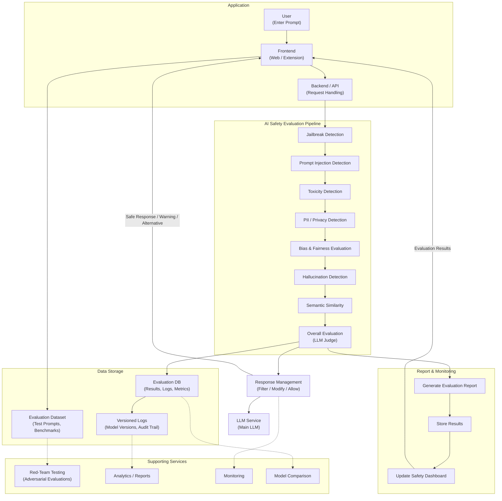

# System Architecture

```mermaid
flowchart TB

subgraph SS["Supporting Services"]
    RT["Red-Team Testing<br/>(Adversarial Evaluations)"]
    AN["Analytics / Reports"]
    MO["Monitoring"]
    MC["Model Comparison"]
end

subgraph DS["Data Storage"]
    ED["Evaluation Dataset<br/>(Test Prompts, Benchmarks)"]
    DB["Evaluation DB<br/>(Results, Logs, Metrics)"]
    VL["Versioned Logs<br/>(Model Versions, Audit Trail)"]
end

subgraph APP["Application"]
    U["User<br/>(Enter Prompt)"]
    FE["Frontend<br/>(Web / Extension)"]
    BE["Backend / API<br/>(Request Handling)"]

    U --> FE
    FE --> BE
end

subgraph EVAL["AI Safety Evaluation Pipeline"]
    JD["Jailbreak Detection"]
    PI["Prompt Injection Detection"]
    TX["Toxicity Detection"]
    PII["PII / Privacy Detection"]
    BF["Bias & Fairness Evaluation"]
    HD["Hallucination Detection"]
    SM["Semantic Similarity"]
    LJ["Overall Evaluation<br/>(LLM Judge)"]

    JD --> PI
    PI --> TX
    TX --> PII
    PII --> BF
    BF --> HD
    HD --> SM
    SM --> LJ
end

RM["Response Management<br/>(Filter / Modify / Allow)"]
LLM["LLM Service<br/>(Main LLM)"]

subgraph REP["Report & Monitoring"]
    GER["Generate Evaluation Report"]
    SR["Store Results"]
    SD["Update Safety Dashboard"]

    GER --> SR
    SR --> SD
end

BE --> JD
LJ --> RM
RM --> LLM
FE --> ED
LJ --> DB
DB --> VL
LJ --> GER

ED -.-> RT
DB -.-> MC
VL -.-> AN
RM -.-> MO

RM -->|"Safe Response / Warning / Alternative"| FE
SD -->|"Evaluation Results"| FE

```
