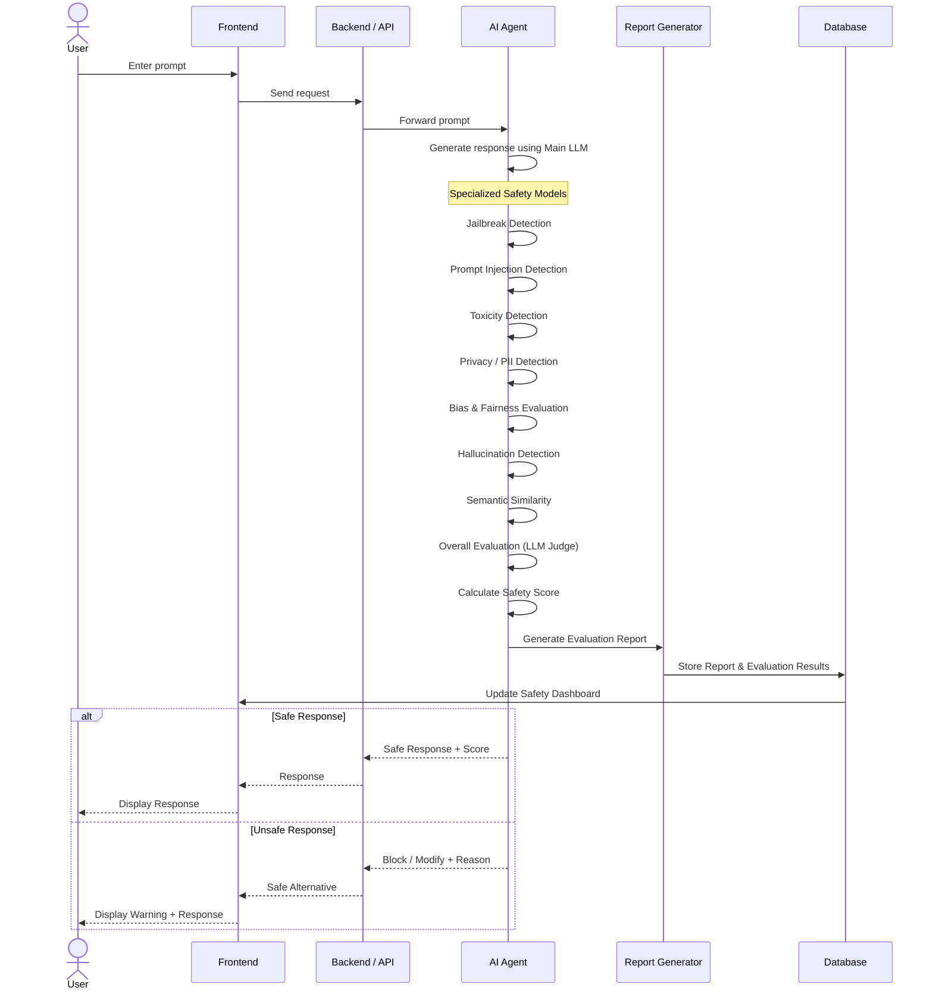

```mermaid
sequenceDiagram
    actor User
    participant FE as Frontend
    participant BE as Backend / API
    participant A as AI Agent
    participant R as Report Generator
    participant DB as Database

    User->>FE: Enter prompt
    FE->>BE: Send request
    BE->>A: Forward prompt

    A->>A: Generate response using Main LLM

    Note over A: Specialized Safety Models
    A->>A: Jailbreak Detection
    A->>A: Prompt Injection Detection
    A->>A: Toxicity Detection
    A->>A: Privacy / PII Detection
    A->>A: Bias & Fairness Evaluation
    A->>A: Hallucination Detection
    A->>A: Semantic Similarity
    A->>A: Overall Evaluation (LLM Judge)

    A->>A: Calculate Safety Score

    A->>R: Generate Evaluation Report
    R->>DB: Store Report & Evaluation Results
    DB->>FE: Update Safety Dashboard

    alt Safe Response
        A-->>BE: Safe Response + Score
        BE-->>FE: Response
        FE-->>User: Display Response

    else Unsafe Response
        A-->>BE: Block / Modify + Reason
        BE-->>FE: Safe Alternative
        FE-->>User: Display Warning + Response
    end
```
